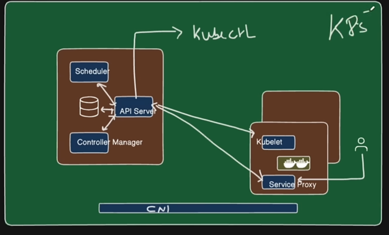

# Kubernetes Documentation  
## 1. Introduction To Kubernetes
* Kubernetes is a system that helps you manage containers, which are packages of applications. It automatically deploys, scales, and repairs these containers on multiple computers, making sure your application stays available and runs smoothly in any environment.
## 2. Monolithic vs microservices  
### Monolithic
* A monolithic application is built as a single, unified codebase where all components are tightly connected and deployed as one unit. This makes it simpler to start with but harder to scale, update, or maintain as it grows. If one part fails, the whole application can be affected. In Kubernetes, a monolithic app is typically run as one or a few large containers, and scaling means replicating the entire app.
### Microservices
* Microservices architecture breaks an application into smaller, independent services, each handling a specific function and communicating via APIs. These services are deployed independently, allowing easier scaling, updates, and flexibility in technology choices. Kubernetes excels at managing microservices by running each service in its own container or pod, providing features like load balancing, scaling, and self-healing for each service independently.

| Aspect         | Monolithic            | Microservices                    |
|----------------|----------------------|---------------------------------|
| Structure      | Single, unified app  | Multiple independent services   |
| Deployment     | One big container    | Many small containers/pods      |
| Scalability    | Scale whole app      | Scale individual services       |
| Maintenance   | Harder as it grows   | Easier with independent services|
| Technology    | One language/frameworks | Mix of languages per service    |
| Kubernetes Fit | Simpler, but less flexible | Ideal, supports distributed services |

## 3. Kubernetes Architecture

* Kubectl: A command-line tool to talk with and control Kubernetes clusters.
* CNI Network: A plugin that connects and manages networking for containers.

### Master Node  
1. API service: The main interface that receives and processes commands for the cluster.
2. Scheduler: Chooses the best worker node to run new pods based on resources.
3. Controller Manager: Monitors and maintains the desired state of the cluster by managing controllers.
4. etcd:  A database that stores all data and configuration about the cluster.

### Working Node
1. kubelet: Runs on each node, making sure containers are running as told by the cluster.
2. service proxy: Manages network communication between pods and services inside the cluster.
